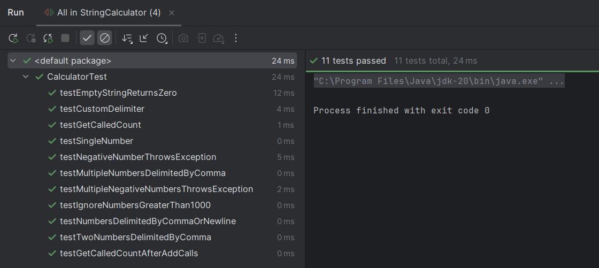
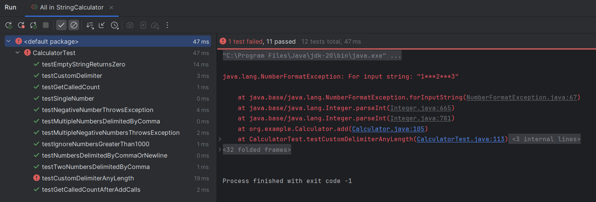

# 🧮 String Calculator TDD Kata (Java)

A fully test-driven solution to the classic String Calculator Kata.  
Developed in Java using JUnit 4 and follows the Red → Green → Refactor TDD cycle strictly.

---

## ✅ Features Implemented

- [x] Return 0 for empty string
- [x] Handle 1 or 2 comma-separated numbers
- [x] Support any number of comma-separated numbers
- [x] Allow newline (`\n`) as a valid delimiter
- [x] Support custom single-character delimiters (e.g., `//;\n1;2`)
- [x] Support custom delimiters of any length (e.g., `//[***]\n1***2***3`)
- [x] Support multiple custom delimiters (e.g., `//[*][%]\n1*2%3`)
- [x] Support multiple delimiters with length > 1 (e.g., `//[**][%%]\n1**2%%3`)
- [x] Throw exception on negative numbers and list them all
- [x] Ignore numbers > 1000
- [x] Count how many times `add()` was called using `getCalledCount()`

---

## 🧪 TDD Cycle Demonstration

Each feature was developed using the TDD (Test-Driven Development) cycle:  
**Red** – Write a failing test → **Green** – Make the test pass → **Refactor** – Clean up the code.

All test progress screenshots are organized below.

| Step | Description                                     | Red (Failing)                                      | Green (Passing)                   |
|------|-------------------------------------------------|----------------------------------------------------|-----------------------------------|
| 1    | Empty string returns 0                          |                    |   |
| 2    | Single number returns itself                    |                    |   |
| 3    | Two comma-separated numbers                     |                    |   |
| 4    | Multiple comma-separated numbers                |                    |   |
| 5    | Support newline delimiters                      |                    |   |
| 6    | Support custom delimiter `//;\n1;2`             |                    |   |
| 7    | Handle negative numbers (throws error)          |                    |   |
| 8    | Track add() call count (compile error)          |  |   |
| 9    | Track add() call count for multiple add() calls |                   |  |
| 10   | Ignore numbers > 1000                           |                   |  |
| 11   | Support multi-char multi-delims `[**][%%]`      |                   |  |
| 12   | Final refactor and full test pass               |                   | ✅ All tests passing               |

---

## 📦 Project Structure

```
string-calculator-kata/
├── src/
│   └── main/java/org/example/Calculator.java
│   └── test/java/CalculatorTest.java
├── assets/
│   └── test-results/*.png
└── README.md
```

---

## 🧪 Running the Tests

Make sure you have Java and Maven or JUnit configured in IntelliJ/CLI.

To run tests using CLI:

```bash
mvn test
```

Or run tests using IntelliJ’s built-in test runner.

---

## 🛠️ Tech Stack

- Java 17+ (works on JDK 8+)
- JUnit 4.13.2
- Maven (optional)
- IntelliJ IDEA (for development)

---

## 🙌 Author

**Kushal Zinzuvadia**  
TDD Enthusiast | Software Developer | Java, Spring Boot, React  
[LinkedIn](https://www.linkedin.com/in/kushalzinzuvadia) | [GitHub](https://github.com/YOUR_USERNAME)

---

## 📜 License

This project is open-source and available under the [MIT License](LICENSE).

---